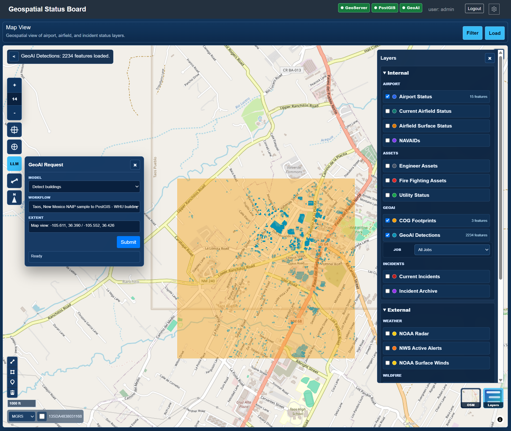

[Portfolio Home: Joseph C. Dillard Geospatial Project Stack](https://josephdillard.github.io/JosephDillard/)

# Status App

This repository contains a status app linkable to geospatial data for dashboard and geospatial view of airport and airfield status. The app brings airport status, airfield condition, support asset, utility, and incident data into one Grails application that can be built and deployed as a single WAR file.

## Features

- Airport and airfield status dashboards.
- Geospatial links from status records into the map view.
- MapLibre GL JS 5.24.0 map view backed by GeoServer WFS/GeoJSON layers, including optional GeoAI detection outputs.
- Configurable basemaps, layer selection, feature filtering, fit-to-layer, fullscreen, distance measurement, drawing, and coordinate readout with MGRS support.
- Route-level Incident Analyst surface that reuses the shared map, incident plotting, Wiki/GeoNames, LLM, response support, popups, table, and Kanban workflows with an added review panel.
- Shared response-support lookup that uses the Incident Analyst bridge for OpenStreetMap support search and local fallback records.
- Temporary coordinate markers with per-marker copy, timestamp, clear, and Google Maps actions.
- Basemap-only minimap overview with a red current-view outline, a minimize button, and click/drag navigation for the main map view.
- Custom route favicons and map symbols for airport, incident, Wiki/GeoNames, and response-support markers.
- Editable lookup tables for dropdown text used by airport and incident workflows.
- Development bootstrap data for New Mexico airports and airfields, current status, runway surface condition, support assets, utilities, current incidents, and archived incidents.
- Single deployable WAR with the application served from `/GeoStatusBoard`.
- Optional Docker Compose stack for local PostGIS, GeoServer, GeoAI, and OpenClaw gateway development.

## Screenshots



The screenshot above shows the geospatial status map with GeoAI detections, the COG footprint overlay, the LLM request panel, service health indicators, and the layers panel.

## Technology

- Grails 5.3.3
- Groovy 3.0.11
- GORM 7.3.3
- Gradle 7.6.6 wrapper
- Java 18 runtime
- Spring Security
- H2 development and test databases
- PostGIS and GeoServer for open source GIS deployment
- MapLibre GL JS 5.24.0 for the browser map
- Docker Compose for optional local GIS, GeoAI, and OpenClaw assistant infrastructure

## Project Layout

- `grails-app/` - Root status app configuration, security, home page, map view, and shared application setup.
- `gsb-airport/` - Airport, airfield, utility, and support asset status module.
- `gsb-incidents/` - Incident, current incident, archived incident, and facility damage module.
- `docs/` - Geospatial architecture notes, PostGIS spatialization SQL, and README images.
- `docker/` - Local PostGIS initialization and GeoServer bootstrap scripts.
- `docker-compose.yml` - Optional local PostGIS, GeoServer, GeoAI, and OpenClaw services.
- `.env.example` - Local Docker, GIS, GeoAI, and OpenClaw configuration defaults.
- `dev.ps1` - Convenience commands for the local Docker GIS, GeoAI, and OpenClaw stack.
- `build.gradle` - Root build, WAR packaging, Java compatibility, and module dependencies.
- `settings.gradle` - Includes the airport and incident modules under the `geospatial-status-board` Gradle root project.

## Repository Map

This repo provides the Grails status-board application, MapLibre map viewer,
GeoServer/PostGIS local stack, incident review surface, and geospatial
architecture notes. The companion repos provide imagery workflows, validation,
ingest, MCP tools, and a focused bridge/demo around the same map operations.

- [Portfolio site](https://josephdillard.github.io/JosephDillard/)
- [Geospatial Status Board repo](https://github.com/JosephDillard/geospatial-status-board)
- [Geospatial Status Board Architecture](docs/geospatial-architecture.md)
- [GeoAI Asset Detection Platform](https://github.com/JosephDillard/geoai-asset-detection-platform)
- [Geospatial Data Gateway](https://github.com/JosephDillard/geospatial-data-gateway)
- [Geospatial MCP Services](https://github.com/JosephDillard/geospatial-mcp-services)
- [Geospatial ETL Validation Toolkit](https://github.com/JosephDillard/geospatial-etl-validation-toolkit)
- Map-to-AI Incident Analyst bridge/demo (local repo; GitHub publication pending)

Key local demo docs:

- [Map Assistant Demo](docs/map-assistant-demo.md)

## Run Locally

Docker is not required for the normal development path. If no PostGIS profile is enabled, the app uses H2 for the root datasource and the named airport/incident datasources.

Use the Gradle wrapper from the repository root:

```powershell
.\gradlew.bat :bootRun
```

The default local URL is:

```text
http://localhost:8080/GeoStatusBoard
```

To run on the development port used in recent local testing:

```powershell
.\gradlew.bat :bootRun --args="--server.port=18088"
```

Then open:

```text
http://localhost:18088/GeoStatusBoard
```

The default seeded admin account is:

```text
username: admin
password: admin123
```

## Optional Docker GIS And Assistant Stack

Use Docker when you want local PostGIS and GeoServer for map/WFS integration testing, the GeoAI API container, or the OpenClaw assistant gateway. The Grails app can still run from IntelliJ or `bootRun`.

Start the infrastructure:

```powershell
.\dev.ps1 up
```

Equivalent raw Docker command:

```powershell
docker compose up -d postgis geoserver
```

Start the full dev infrastructure, including the GeoAI API container with
TensorFlow/Keras:

```powershell
.\dev.ps1 up-geoai
```

Start the optional OpenClaw gateway container:

```powershell
.\dev.ps1 up-openclaw
```

This command also initializes OpenClaw's local gateway config and creates an
ignored `.env` file with a generated `OPENCLAW_GATEWAY_TOKEN` when one is
missing.

Equivalent raw Docker command:

```powershell
.\dev.ps1 init-openclaw
docker compose --profile openclaw up -d openclaw-gateway
```

Default local endpoints:

```text
PostGIS:   localhost:5432/geostatusboard
GeoServer: http://localhost:8081/geoserver
WFS:       http://localhost:8081/geoserver/gsb/ows
GeoAI:     http://localhost:8000
Gateway:   http://localhost:7070
OpenClaw:  http://localhost:18789
OpenClaw health: http://localhost:18789/healthz
OpenClaw ready:  http://localhost:18789/readyz
```

Default local credentials:

```text
PostGIS user/password: gsb / gsb
GeoServer user/password: admin / geoserver
```

To customize ports, image tags, credentials, or the WFS URL:

```powershell
Copy-Item .env.example .env
```

Then edit `.env`. The `.env` file is intentionally ignored by Git.

For OpenClaw, keep the generated `OPENCLAW_GATEWAY_TOKEN` private and replace it
with your own secret before exposing the gateway outside your own development
machine. The compose profile uses the published
`ghcr.io/openclaw/openclaw:latest` image by default and persists OpenClaw state in
Docker volumes named `gsb-openclaw-state`, `gsb-openclaw-workspace`, and
`gsb-openclaw-auth-secrets`.

`GEOSERVER_WFS_MAX_FEATURES` controls the GeoServer WFS service cap used by the
bootstrap container. The default is `5000`, while the map viewer requests at least
`geo.viewer.maxFeatures` (`500` by default) for internal WFS layers.

The `geoai` Compose profile builds the sibling GeoAI repo from
`GEOAI_CONTEXT=../geoai-asset-detection-platform`. It bind-mounts that repo's
`src/`, `config/`, `scripts/`, and `sql/` folders for a faster dev loop, plus the
ignored `data/`, `models/`, `outputs/`, and `logs/` folders so downloaded models,
sample COGs, masks, vectors, and API logs remain local developer artifacts.

On NVIDIA RTX laptops, the GeoAI container requests one NVIDIA GPU by default and
builds with CUDA-enabled PyTorch wheels. Docker Desktop must be using the WSL 2
backend with NVIDIA Container Toolkit support. To force a CPU-only GeoAI image,
set this in `.env` before rebuilding:

```text
GEOAI_PYTORCH_INDEX_URL=https://download.pytorch.org/whl/cpu
```

On first start, the GeoAI container downloads the open-source HF U-Net/Keras road
model, the WHU building segmentation model, and the Taos NAIP sample COG if they
are missing. Set `GEOAI_DOWNLOAD_HF_MODEL=false`,
`GEOAI_DOWNLOAD_HF_BUILDING_MODEL=false`, or `GEOAI_FETCH_SAMPLE_COG=false` in
`.env` to disable any automatic download.

The OpenClaw profile gives the app a containerized assistant gateway foundation
for the map command assistant demo. The current app endpoint turns prompts into
allow-listed map/page actions and requires a reviewed draft flow before write
actions, such as plotting an incident, can be saved.

### Keep Grails on H2

Run the app normally:

```powershell
.\gradlew.bat :bootRun
```

This path uses H2. If GeoServer is not running, the map page remains usable for basemaps and tools and reports GeoServer layer failures in the map status panel.

### Run Grails Against PostGIS

Start the Docker infrastructure, then run the app with the `postgis` Spring profile:

```powershell
.\dev.ps1 up
$env:SPRING_PROFILES_ACTIVE = 'postgis'
.\gradlew.bat :bootRun
Remove-Item Env:SPRING_PROFILES_ACTIVE
```

For IntelliJ, set either the VM option:

```text
-Dspring.profiles.active=postgis
```

or the environment variable:

```text
SPRING_PROFILES_ACTIVE=postgis
```

After the app has created the tables in PostGIS, apply the spatial columns/indexes and rerun the GeoServer bootstrap:

```powershell
.\dev.ps1 spatialize
```

The spatialization script adds `geom geometry(Geometry, 4326)` columns and GiST indexes. For the built-in development sample data, it also seeds approximate New Mexico point and polygon geometries so the map draws immediately. Replace those sample geometries with authoritative source geometry for production data.

Useful Docker helper commands:

```powershell
.\dev.ps1 logs
.\dev.ps1 logs-geoai
.\dev.ps1 logs-openclaw
.\dev.ps1 build-geoai
.\dev.ps1 geoserver-init
.\dev.ps1 init-openclaw
.\dev.ps1 openclaw-status
.\dev.ps1 openclaw-dashboard
.\dev.ps1 down
.\dev.ps1 reset
```

`init-openclaw` writes the local gateway config and creates an ignored `.env`
token if needed. `openclaw-status` runs the OpenClaw CLI sidecar probe.
`openclaw-dashboard` prints the Control UI URL without trying to open a browser
from inside Docker. `reset` removes the local Docker volumes and recreates empty
PostGIS, GeoServer, and OpenClaw state.

## Build

Build the full project:

```powershell
.\gradlew.bat clean build
```

The deployable WAR is created at:

```text
build/libs/GeoStatusBoard.war
```

## Deployment Context

The app is configured to run under:

```text
/GeoStatusBoard
```

For example:

```text
http://localhost:8080/GeoStatusBoard
```

## Lookup Data

Dropdown values are managed through editable lookup tables so an administrator can update display text without changing domain constraints or GSP files.

Useful admin routes include:

```text
/GeoStatusBoard/airportLookupOption
/GeoStatusBoard/incidentLookupOption
```

Airport and incident lookup bootstrapping seeds New Mexico airports, airfields, event types, event categories, sources, status values, and agency-style service-owner values for development and test data. Service-owner options focus on FEMA, federal land/fire agencies, New Mexico state agencies, local fire departments, airport authorities, and emergency management organizations.

## Bootstrap Test Data

Bootstrap test data is enabled by default outside production. It adds missing sample rows to development/test tables without duplicating rows on every restart, so existing dev databases can pick up newly added seed data after the app restarts. Synthetic status and incident records only seed outside production. Current seed coverage includes:

- Airport status and current SIT rows for 15 New Mexico locations.
- Runway and airfield surface condition records.
- Engineer and fire fighting support asset records.
- Utility status records.
- Current incident records.
- Archived incident records.

Bootstrapped locations include Kirtland AFB, Holloman AFB, Cannon AFB, Albuquerque International Sunport, Roswell Air Center, Spaceport America, Las Cruces International Airport, and other New Mexico airfields.

## Geospatial View

The app includes a MapLibre-based geospatial view at:

```text
/GeoStatusBoard/map
```

The focused Incident Analyst route is available at:

```text
/GeoStatusBoard/incident-analyst
```

It reuses the shared MapLibre map view instead of carrying a duplicate map
implementation. The same layer drawer, basemap selector, incident plotting,
Wiki/GeoNames place exploration, LLM request panel, response-support lookup,
MGRS/coordinate tools, measurement, incident symbology, and incident popups are
available on both map entry points. The analyst route defaults to the Current
Incidents layer, filters that layer to the Santa Fe-to-Colorado-border review
area, and adds a right-side review panel with risk scoring, table/Kanban links,
and nearby response support.

Response-support lookup proxies to the standalone incident analyst bridge by
default:

```text
INCIDENT_ANALYST_BRIDGE_URL=http://127.0.0.1:8775/incident-analyst
```

The map calls the same-origin proxy below, which forwards to the bridge and
keeps browser behavior consistent on both map routes:

```text
GET /GeoStatusBoard/incident-analyst/api/osm/support?latitude=35.687&longitude=-105.938&radius_m=20000
```

That keeps the portfolio/demo repo useful while giving the main app a clean
integration point. The bridge can later be replaced with a direct MCP client or
in-app service without changing the browser route. If OpenStreetMap times out or
is unavailable, the tool shows local response-support fallback records when any
are near the selected point.

GSP links can open the map with a selected layer and feature filter, for example:

```text
/GeoStatusBoard/map?layer=airportStatus&field=site_name&value=Kirtland%20AFB
```

The map configuration lives under `geo.viewer`, `geo.geoserver`, `geo.placeSearch`,
`geo.incidentAnalyst`, and `geo.layers` in `grails-app/conf/application.yml`.
MapLibre GL JS and CSS are pinned to `maplibre-gl@5.24.0` through
`geo.viewer.mapLibreJsUrl` and `geo.viewer.mapLibreCssUrl`; the controller
fallback uses the same exact version. The current default basemaps are CARTO
Dark Blue and OpenStreetMap, and configured layers include airport status,
current airfield status, airfield surface status, NAVAIDs, engineer assets,
fire fighting assets, utility status, GeoAI COG footprints, GeoAI detections,
current incidents, and incident archive. Airport and airfield point layers use
the airport symbol set, current and archived incident layers use the FEMA-style
incident symbol set, and the Wiki/GeoNames and response-support tools draw their
own result markers above the operational layers.

Wiki/GeoNames place exploration works directly from the map. Set
`GEONAMES_USERNAME` or `geo.placeSearch.geonamesUsername` to use GeoNames nearby
Wikipedia first; when no GeoNames username is configured, the browser falls back
to the public Wikipedia GeoSearch API.

Coordinate copy mode leaves temporary coordinate markers on the map. Multiple
markers can be kept at once; clicking a marker reselects that coordinate,
updates the coordinate readout, and opens an attribute popup with MGRS, Lat/Lon,
DMS, timestamp, copy, Google Maps, and clear actions. The small marker button in
the coordinate readout clears the active marker without clearing the rest.

The map includes a basemap-only minimap overview. The minimap opens with the map,
draws a red outline around the current main-map view, follows basemap changes,
can be minimized, and can be clicked or dragged to move the main map without
loading operational WFS layers into the overview.

The map also includes a compact GeoAI request panel. It loads model choices from the
GeoAI API through same-origin Grails proxy routes, submits the selected model,
workflow, current MapLibre extent, and optional drawn AOI, then polls the returned run
id. Drawn AOI polygons are normalized before submission, including selected or
active draw features and closed polygon rings, so the GeoAI API receives
`map_context.aoi_geojson` instead of silently falling back to only the current
map view:

- `GET /GeoStatusBoard/geoAi/options`
- `POST /GeoStatusBoard/geoAi/runs`
- `GET /GeoStatusBoard/geoAi/runs/{run_id}`

Configure the target API with `geo.geoai.apiUrl` or the `GEOAI_API_URL` environment
variable. If GeoAI is unavailable, the map remains usable and the panel shows the
request failure instead of blocking map tools.

When the selected workflow loads PostGIS features, the map refreshes `GeoAI Detections`
and selects the returned API run id in the layer's job filter. Zero-feature runs leave
the existing detection layer intact.

When a GeoAI workflow writes to `public.detected_roads` in the local PostGIS
database, rerun `.\dev.ps1 geoserver-init` to publish `gsb:detected_roads`.
The map exposes it as the `GeoAI Detections` layer under the `GeoAI` category and
adds a job filter under that layer when `job_id` values are present. The COG
inventory footprint table is `public.geoai_cog_footprints` and is exposed as
`COG Footprints`.

The hub page and map health strip include the companion Geospatial Data Gateway
and OpenClaw assistant gateway next to GeoServer, PostGIS, and GeoAI. The map can
subscribe to the Data Gateway's local SignalR hub and refresh a configured WFS
layer when the gateway broadcasts `layer.refresh_requested`. Configure it with:

```text
GEOSPATIAL_GATEWAY_SIGNALR_ENABLED=true
GEOSPATIAL_GATEWAY_HUB_URL=http://localhost:7070/hubs/geospatial-updates
```

OpenClaw is configured separately:

```text
OPENCLAW_ENABLED=true
OPENCLAW_GATEWAY_URL=http://localhost:18789
OPENCLAW_HEALTH_URL=http://localhost:18789/healthz
OPENCLAW_READY_URL=http://localhost:18789/readyz
```

For a local smoke test while the map is open, trigger a refresh event:

```powershell
Invoke-RestMethod `
  -Method Post `
  -Uri http://localhost:7070/demo/layer-refresh `
  -ContentType 'application/json' `
  -Body '{"layerKey":"detectedRoads","message":"Manual local SignalR demo refresh."}'
```

The recommended open source GIS stack is:

- PostGIS for geospatial columns and spatial indexes in the operational database.
- GeoServer for publishing database tables as WFS GeoJSON layers.
- MapLibre GL JS 5.24.0 for the browser map view.

The Grails domains continue to read and write regular status fields through GORM. GeoServer reads geometry from PostGIS and supplies the map API. Weather, imagery, flight, road, or other external feeds can be added as additional GeoServer-published layers or direct map tile/vector services when the provider terms allow it.

See:

- `docs/postgis-spatialization.sql`
- `docs/geospatial-architecture.md`

## Development Roadmap

OpenClaw is now available as an optional Docker gateway for the local development
stack, and the map includes a demo assistant panel at `/GeoStatusBoard/assistant`.
The current planner is deterministic so the workflow can be demoed without
external AI credentials, while still using the same reviewed, structured action
contract planned for an OpenClaw-backed model call.

Supported demo requests include:

- "Plot a wildfire incident at 34.904222, -106.575583."
- "Zoom to high-risk incidents north of Santa Fe."
- "Find response support near the selected incident."
- "Turn on airports, current incidents, and GeoAI detections."
- "Draw an AOI around this view and submit a GeoAI road-detection run."

The first app-connected version routes commands to existing map capabilities
instead of creating a separate automation stack. Read-only commands can pan,
toggle layers, run Wiki/GeoNames or response-support lookups, summarize visible
incidents, and navigate to existing incident pages. Write commands, such as
creating or editing an incident, return a preview and require explicit user
review before anything is saved.

Recommended implementation phases:

1. Add a structured intent endpoint that converts a prompt plus map context into
   an allow-listed action plan.
2. Execute read-only map actions in the browser: pan/zoom, layer toggles,
   filters, popups, summaries, and support/place searches.
3. Add reviewed write actions for incident plotting and incident updates.
4. Add an audit trail showing the prompt, interpreted action, user approval, and
   final map/database change.

## Recent Local Changes

- Added an optional Docker Compose GIS stack for local PostGIS and GeoServer testing.
- Added a GeoAI Docker Compose profile for TensorFlow/Keras road segmentation while Grails runs locally.
- Added an open-source WHU building segmentation workflow for visible Taos NAIP GeoAI detections.
- Added a `postgis` Spring profile while keeping H2 as the default development and test database.
- Added GeoServer WFS timeout handling so missing local GeoServer services fail gracefully in the map status panel.
- Added PostgreSQL-safe table/formula mappings for the local PostGIS development profile.
- Added development sample geometries for the bootstrapped New Mexico records.
- Added editable lookup tables, richer New Mexico bootstrap data, and MapLibre map tools for basemaps, layers, feature filtering, measurement, drawing, fullscreen, MGRS, coordinate readout, temporary coordinate markers, and a basemap-only minimap.
- Added top-nav health indicators and a MapLibre GeoAI request panel for submitting map-context jobs with normalized drawn AOIs to the GeoAI workflow API.
- Added a shared Incident Analyst map route with the same plotting, LLM, Wiki/GeoNames, response-support, layer, popup, table, and Kanban workflows as the main map.
- Added response-support lookup through the Incident Analyst proxy, with OpenStreetMap lookup and local fallback messaging.
- Added custom map icons for airports, incident layers, Wiki/GeoNames results, and response-support results.
- Added custom route favicons and a minimizable overview map that opens with the main map.
- Added Data Gateway health/link visibility on the hub and map service status surfaces.
- Added an optional OpenClaw Docker Compose profile, health status, and hub links as the foundation for a map command assistant.
- Added a demo map assistant panel with allow-listed map/page actions, reviewed incident draft staging, and OpenClaw-ready integration docs.
- Pinned MapLibre GL JS/CSS assets to stable `maplibre-gl@5.24.0`.

## Data Sources

The root app configures the default datasource plus named datasources used by the included modules:

- `dataSource` - Root app data.
- `geodbfour` - Airport, airfield, utility, and support asset data.
- `geodbthree` - Incident data.

Development and test environments use H2 databases by default.

The optional `postgis` Spring profile points all three datasources at the same local PostGIS database so GeoServer can publish airport, asset, utility, and incident tables from one datastore.

The PostGIS profile override lives in:

```text
grails-app/conf/application-postgis.yml
```
