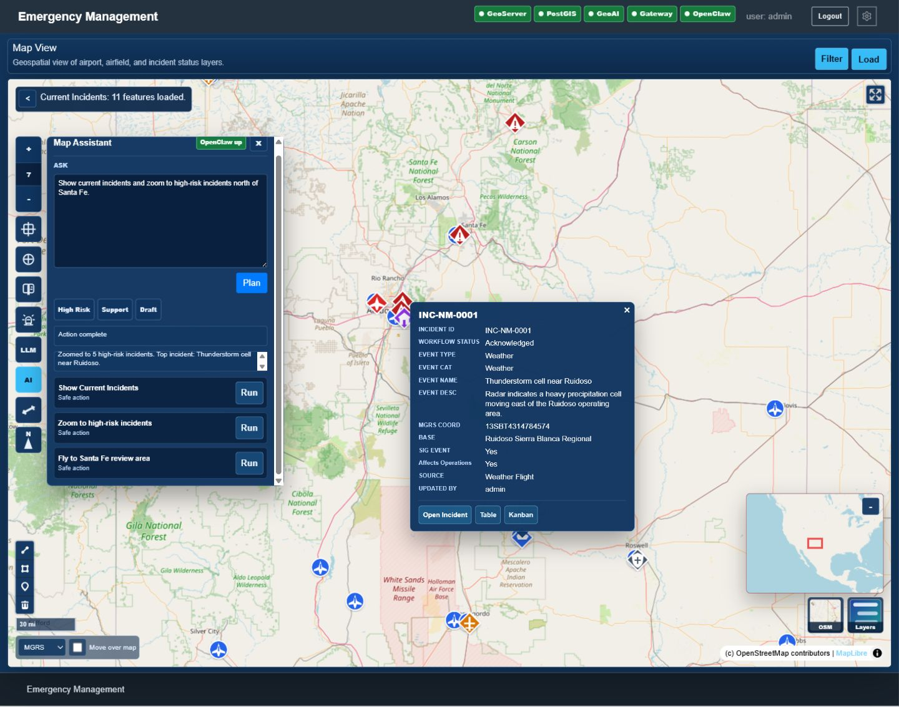
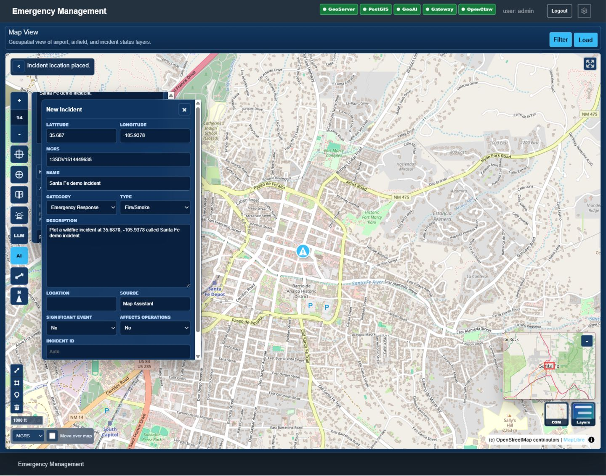
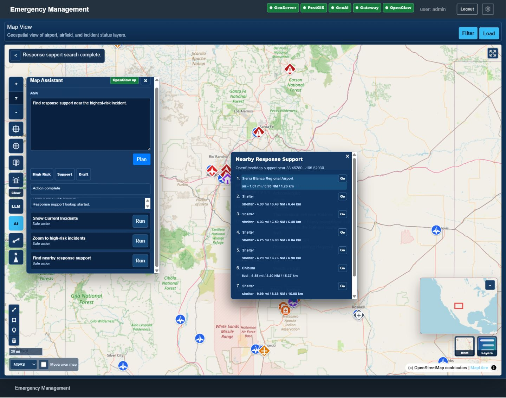

# Map Assistant Demo

The map assistant is an OpenClaw-ready command panel inside the shared
GeoStatusBoard MapLibre map. It turns a natural-language prompt into a reviewed
action plan and only executes allow-listed map/app actions.

## Run The Demo

Start the optional infrastructure:

```powershell
.\dev.ps1 up
.\dev.ps1 up-geoai
.\dev.ps1 up-openclaw
```

Run the Grails app:

```powershell
.\gradlew.bat :bootRun
```

Open:

```text
http://localhost:18088/GeoStatusBoard/assistant
```

The `/assistant` route opens the normal map with the assistant panel visible.
The assistant also remains available from the `AI` button on the map control
rail.

## Demo Prompts

```text
Show current incidents and zoom to high-risk incidents north of Santa Fe.
```

Shows the Current Incidents layer and zooms to incidents scored as high risk.
The client-side risk score uses significant-event flag, air-operations impact,
workflow status, and event type.

```text
Find response support near the highest-risk incident.
```

Runs the existing response-support lookup near the highest-risk loaded
incident. If OpenStreetMap is unavailable, the existing local fallback response
support behavior is still used.

```text
Search Wiki nearby the center of the map.
```

Runs the existing Wiki/GeoNames nearby-place workflow at the current map center.

```text
Plot a wildfire incident at 35.6870, -105.9378 called Santa Fe demo incident.
```

Stages a reviewed incident draft in the existing Create Incident form and places
the draft marker. The assistant does not save the incident; the user must review
the form and click `Save`.

```text
What is running in the system?
```

Calls the service-health endpoint and summarizes GeoServer, PostGIS, GeoAI, Data
Gateway, and OpenClaw.

## Implemented Actions

- `map.flyTo`
- `map.flyToMgrs`
- `map.toggleLayer`
- `incident.zoomHighRisk`
- `incident.summarizeVisible`
- `incident.previewCreate`
- `place.wikipediaSearch`
- `support.search`
- `geoai.openPanel`
- `service.healthSummary`
- `navigate`

## Screenshots

Click any screenshot to open the full-size image.

### High-Risk Incident Review

The assistant builds a safe action plan, enables Current Incidents, zooms to
high-risk incidents, and opens the existing incident popup.

[](images/map-assistant-high-risk-plan.png)

### Reviewed Incident Draft

The assistant stages a wildfire incident in the existing Create Incident form.
The form is populated for review, but nothing is saved until the analyst clicks
`Save`.

[](images/map-assistant-incident-draft.png)

### Response Support Lookup

The assistant reuses the existing emergency-support lookup and opens nearby
OpenStreetMap support results around the incident location.

[](images/map-assistant-support-lookup.png)

## Notes

The current planner is deterministic so the demo can run without external AI
credentials. OpenClaw is surfaced through Docker, health status, and the
assistant integration boundary. The next iteration can replace or augment the
deterministic planner with an OpenClaw-backed model call while keeping the same
allow-listed action contract.
